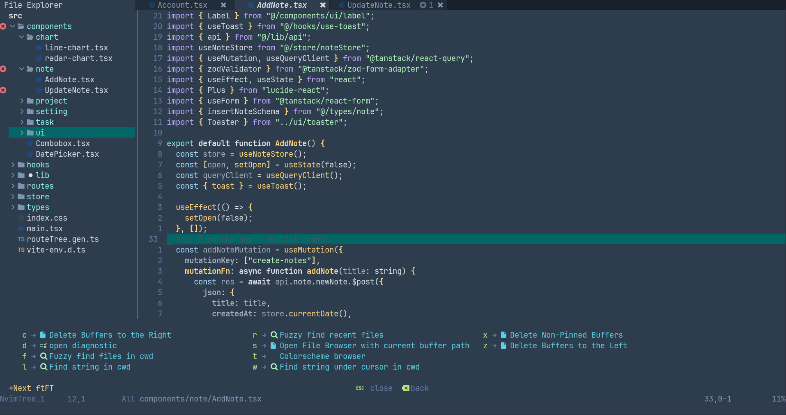
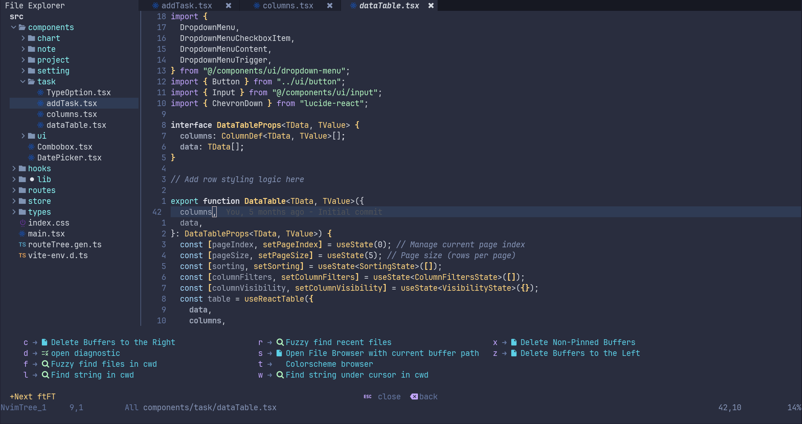
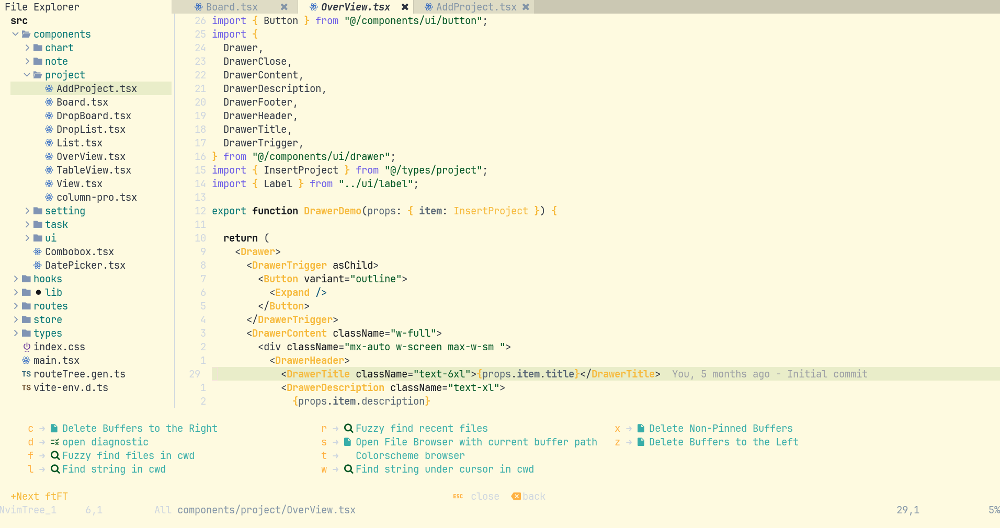

# 🪨 stone.nvim

A clean, minimal, and versatile Neovim colorscheme with `base`, `dark`, and `light` variants.

### Base Variant


### Dark Variant


### Light Variant


- 3 carefully tuned variants
- Tree-sitter support
- Telescope + GitSigns styling
- Clean UI with minimal noise

---

# 🔧 Installation

Using [lazy.nvim](https://github.com/folke/lazy.nvim):

```lua
{
  "wesenseged/stone.nvim",
  priority = 1000,
  config = function()
  require("stone").setup({
     variant = "light",
     transparent_background = true,
-- other options...
      })
  end,
}
```

---

# Configuration

There is no need to call setup if you don't want to change the default options and settings.

```lua
require("stone").setup({
  variant = "base", -- "base" | "dark" | "light"
  transparent_background = false,
  styles = {
    comments = { "italic" },
    functions = { "bold" },
  },
  color_overrides = {
    -- accent = "#ff007f", -- override accent color
  },
  integrations = {
    nvimtree = true,
    mason = true,
    telescope = true,
    lazy = true,
    which_key = true,
  },
})
```

---

# Usage

```vim
 colorscheme stone-base " stone-base, stone-dark, stone-light
```

```
vim.cmd.colorscheme "stone-base"
```

---

# Integrations

Stone provides theme support for other plugins in the Neovim ecosystem and extended Neovim functionality through integrations.

To enable/disable an integration you just need to set it to true/false, for example:

```lua
require("stone").setup({
  integrations = {
    nvimtree = true,
    mason = true,
    telescope = true,
    lazy = true,
    which_key = true,
  },
  })
```

---

## License

This project is licensed under the MIT License. See the [LICENSE](LICENSE) file for details.

---

## Contributing

Contributions, issues, and feature requests are welcome! Feel free to open an issue or submit a pull request.

---

Thank you for using stone.nvim! 🌟


